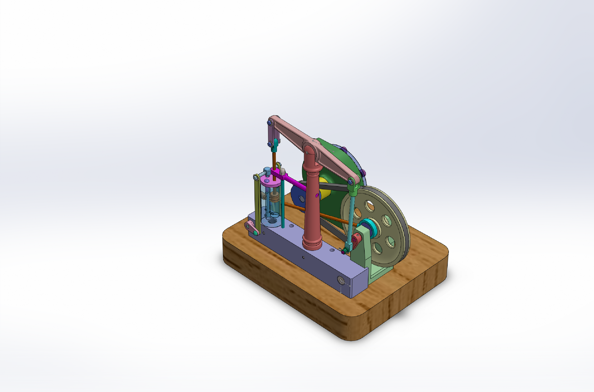

# Steam Engine with Horizontal Beam and Centrifugal Pump

This project is a complete SolidWorks CAD design featuring a full mechanical assembly, individual part files, engineering drawings, viewable exports, and an assembly motion animation.

## Preview


## Assembly Animation

[Watch the assembly animation](media/assembly-animation.mp4)

[](media/assembly-animation.mp4)

## Project Contents

- Full SolidWorks assembly
- 46 SolidWorks part files
- SolidWorks sub-assembly file
- SolidWorks drawing files
- STEP export for viewing without SolidWorks
- PDF drawing exports
- Preview images
- Assembly animation video

## Folder Structure

```text
cad/
  Steam Engine Assembly.SLDASM      Main SolidWorks assembly
  parts/                            Native SolidWorks part files
  sub-assemblies/                   Native SolidWorks sub-assembly files
  drawings/                         Native SolidWorks drawing files

exports/
  step/                             STEP export of the full assembly
  pdf/                              PDF drawing exports
  images/                           Preview images for GitHub

media/
  Assembly animation video and thumbnail
```
